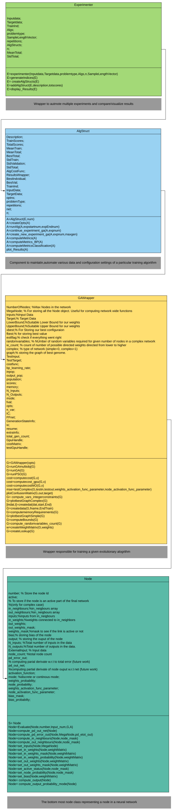
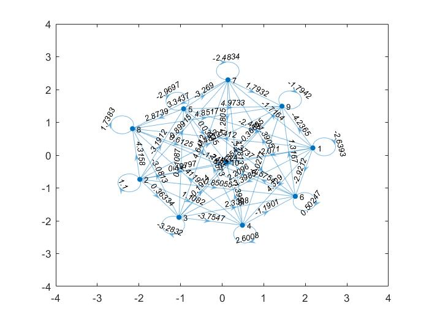

# Neural network training using evolutionary algorithms

Traditional neural networks use Back Propagation for training the network. However, since backpropagation uses gradient descent for optimization, the approach could result in network modeling a local minima. This repository is aimed at training the neural networks using evolutionary algorithms.
## Getting Started
The complete code is implemented in MATLAB. To speedup the computations parallel processing toolbox of MATLAB is used. In addition CUDA code for training using GPU's is also provided. To use GPU support one must have CUDA runtime installed on their computer already. For installing the CUDA runtime please visit the NVIDIA website.  Detailed instructions for training on GPU will follow later.
### Cloning the repository

To clone the repository please use the following command in commnand prompt/terminal.
```
git clone https://github.com/saikrishh123/Efficient-Learning-in-Deep-Learning-through-Evolutionary-Computations
```
## Architecture
At high level, the repository contains four major classes responsible from training of neural networks using EA's to automating, visualizing and analyzing the process. A high level architecture is as follows. More detailed documentation will be provided in future. 

####  


### Running first test

As a simple example we train the neural network using genetic algorithm for the iris dataset

```matlab
load iris_input
load iris_target
e=experimenter(iris_input,iris_target,'classification',{'gaSimple','psoSimple'},15,[50]); % training using GA,PSO. 15 node completely connected network, 50 samples per class. Default 10 repititions

e.AlgStructs{1}=e.AlgStructs{1}.runAlg % Training using GA.
```

### Comparison Results

Comparison results of training using various algorithm

 

 

## Sample Neural Network Model

 


## Contributing

As of now there is a lot of work that can be done in future extending the development to accommodate hybrid training, exploring one-shot learning, structuring and organizing the code, detailed documentation and testing, Any new ideas are also welcomed. Interested developers could please contact me for any contributions. 

## Author

Author: Sai Krishna Kalluri

Email: saikrishna.kalluri@outlook.com

## License

This project is licensed under the MIT License